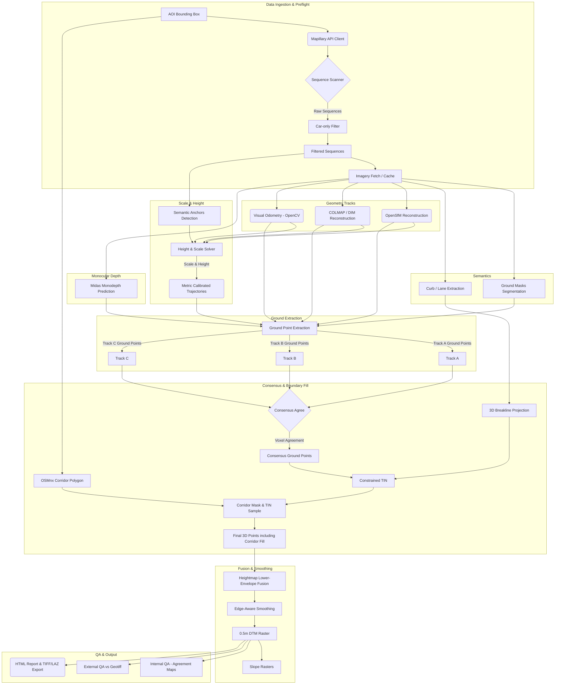

# Mapillary DTM Architecture

This document describes the high-level architecture and data flow of the `mapillary_dtm` pipeline. The pipeline focuses on maximizing accuracy via redundancy and cross-validation, using multiple independent reconstruction backends, and strictly requiring ground-only semantic evidence.

## Pipeline Diagram

## Core Principles

1.  **Strict Production Run:** The pipeline strictly runs on actual models (e.g., PyTorch models for monodepth/segmentation, COLMAP, OpenSfM) and fails fast if the necessary infrastructure is unavailable. Mocks and synthetic fallbacks are strictly not used to guarantee data science integrity.
2.  **Redundancy everywhere**: Two independent SfM stacks (OpenSfM, COLMAP) plus VO, resolving consensus.
3.  **Metric scale**: Derived from constant camera height per sequence, GNSS distance consistency, and semantic footpoint anchors.
4.  **Ground-only focus**: 3D semantic voting from per-image ground masks; rejection of dynamic obstacles.
5.  **Slope fidelity**: Edge-aware smoothing and breakline enforcement preserving curbs/crowns.
