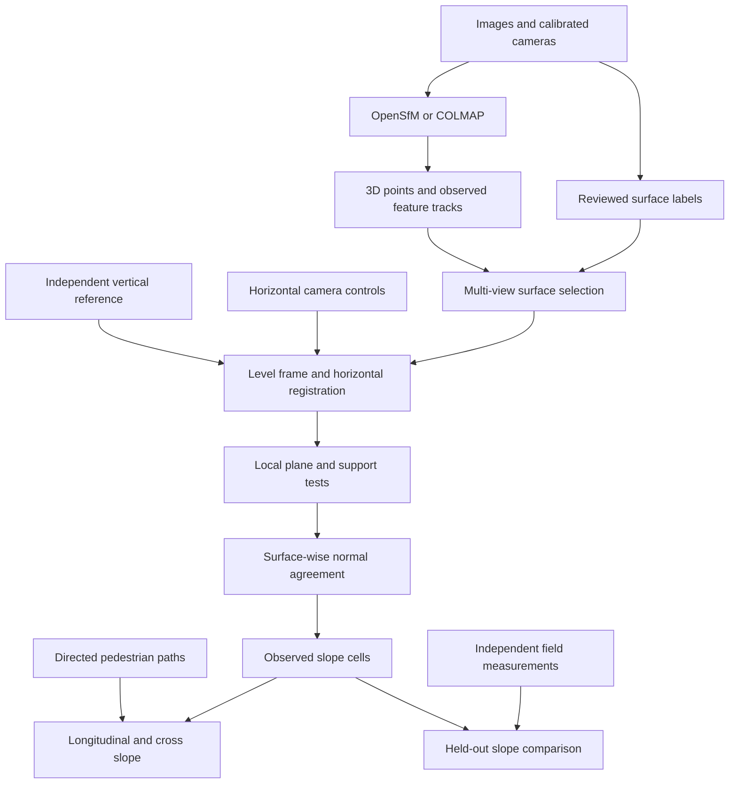

# Slope model architecture

The primary package is `slope_from_mapillary`. The historical name
`dtm_from_mapillary` remains only for repository-local acquisition/backend imports
and a command-line redirect. The elevation measurement pipeline has been retired.

## Module boundaries

| Module | Responsibility |
| --- | --- |
| `reconstruction.py` | Parse native poses and actual feature tracks; keep component frames explicit |
| `reference.py` | Independent up vector, calibrated IMU helper, robust horizontal similarity |
| `surfaces.py` | Vote per observed feature pixel; reject unknown classes and weak geometry |
| `segmentation.py` | Optional real dense semantic model inference, with model/image provenance |
| `estimation.py` | Robust plane fitting, support gates, gradients, directional uncertainty |
| `grid.py` | Supported cells and full-normal agreement; shared images count as one evidence group |
| `output.py` | GeoTIFF/GeoJSON/report export and exact path splitting at grid boundaries |
| `validation.py` | Compare exports against independent reference observations; no feedback to fitting |
| `pipeline.py` | One orchestration path, configuration validation, audits and input hashes |
| `cli.py` | Prepare, audit, segment, run and validate commands |

## Contracts

A project has one local metric CRS, explicit semantic surface IDs, and one or more
reconstruction records. Each record has its own raw coordinate system, vertical
reference, horizontal controls, masks, and evidence group. Georeferencing never
uses altitude. A single isotropic scale applies to all three axes.

An OpenSfM component is loaded explicitly by index. COLMAP input is one exported
component directory. Do not join component coordinates or vertical datums before
estimating normals. The retained backend runners delegate cached-model parsing
to the same native readers used by the slope pipeline.

For each surface and reconstruction, only nearby measured points are considered.
The cell center and all four cell corners must be inside the accepted point hull
and close to actual inliers. Residual, two-dimensional support and conditioning
gates reject discontinuities and unstable planes. There is no DTM interpolation.

Overlapping measurements are compared by their **full upward normals**. Equal
slope magnitudes pointing in opposite directions do not count as agreement.
Disagreement removes the cell. Agreement does not establish truth, and adding a
backend on the same images does not increase the independent-capture count.

Paths select a surface explicitly. A road estimate cannot silently replace a
sidewalk estimate. Multiple physical levels need different IDs even if both are
classified as road. Automated segmentation distinguishes semantic kinds only;
reviewed instance masks are required where those kinds contain multiple levels.

Unknown cells remain NoData. A result without a calibrated uncertainty budget
can carry a slope estimate but its threshold status is `uncertainty_unknown`.
All estimates remain `not_field_validated` until evidence is reviewed; a successful
software run does not certify a route's accessibility.
